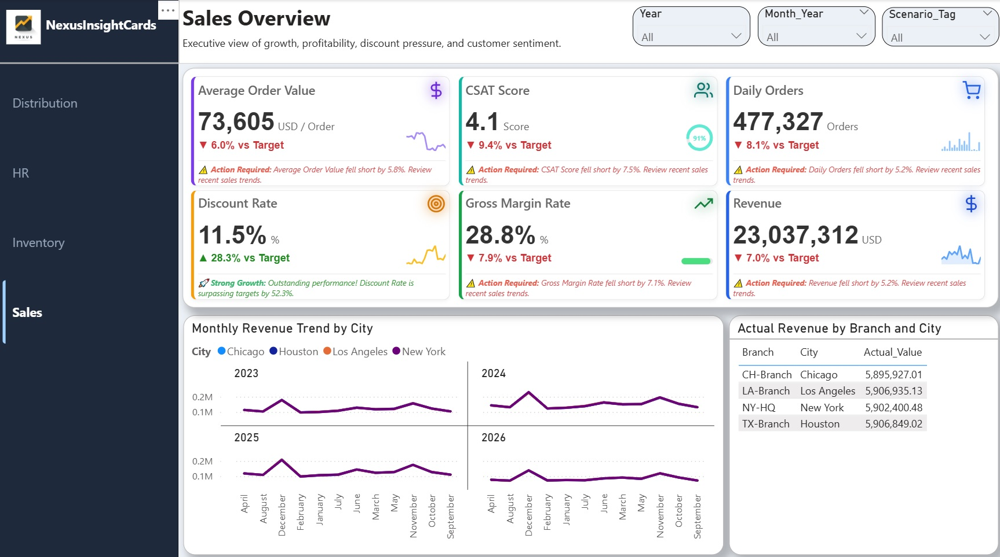

  
  <h1>Nexusinsightcards</h1>
  
<strong>Advanced Smart KPI Grid Custom Visual for Microsoft Power BI</strong>

## Overview
**Nexusinsightcards** is an enterprise-grade custom visual for Microsoft Power BI. It transforms standard reporting into an actionable executive dashboard. By dynamically generating a grid of KPI cards based on input measures, it delivers high-density insights, trend analysis, and instant managerial alerts in a single, highly optimized, and visually stunning component.

## Visual Preview
*Executive view of growth, profitability, discount pressure, and customer sentiment.*

## Key Features
- **Smart Alert Footers:** Automated, threshold-based intelligent text alerts (e.g., *Action Required*, *Strong Growth*) that provide managers with split-second contextual insights.
- **Advanced Variance & YoY Analysis:** Built-in capabilities to compare current performance against previous years, automatically calculating and displaying growth or loss rates.
- **Integrated Sparklines:** Embedded micro-charts for immediate trend visualization without cluttering the canvas.
- **Dynamic Formatting & Units:** Fully dynamic unit displays (e.g., USD, Orders, %) and custom measure-driven formatting to ensure pristine data presentation.
- **Custom Iconography:** Ability to assign and render specific, high-quality icons for individual KPI categories.
- **Polished UI/UX:** Modern card design featuring dynamic shadow effects and responsive layouts that elevate the overall dashboard aesthetic.

## Data Roles Configuration
To fully utilize the smart features of this visual, map your Power BI fields as follows:
- **KPI Category:** The dimension used to generate and split the individual cards.
- **Main Measure:** The primary numeric value to be displayed and formatted dynamically.
- **Comparison / Target Measure:** Used for YoY calculations and variance percentages.
- **Trend Axis (Date):** Required for rendering the embedded sparklines.

## Installation
1. Download the latest `.pbiviz` file from the [Releases](../../releases) section.
2. Open **Power BI Desktop**.
3. In the **Visualizations** pane, click the three dots (`...`) and select **Import a visual from a file**.
4. Import the Nexusinsightcards visual and start building your executive views.

## Author & Support
- **Brand:** Nexusinsightcards
- For enterprise implementation, custom feature requests, or support, please reach out via our official channels.
